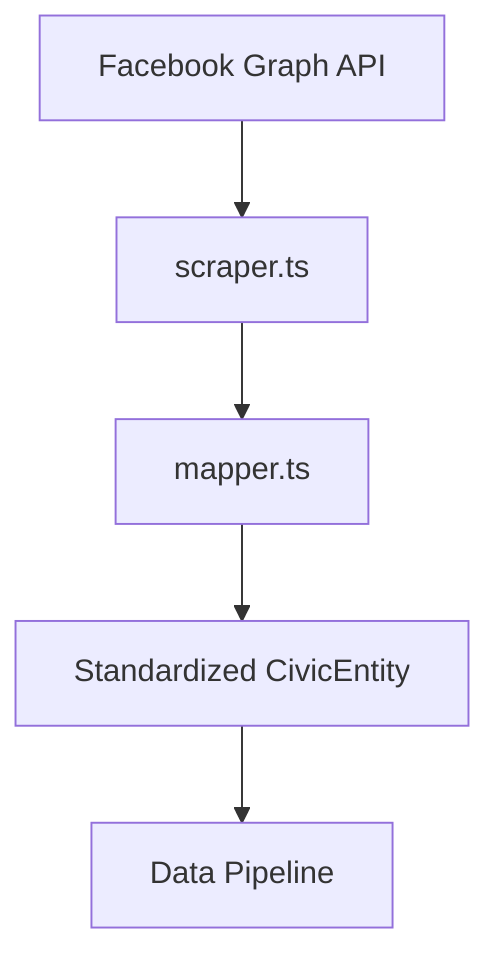

# Facebook Connector for "Hip Cookeville"

## Purpose
Aggregates posts and comments from the "Hip Cookeville" Facebook community group to analyze civic engagement patterns and local discourse trends. Automates monitoring of social media discussions that impact local governance participation.

## Key Features
- **OAuth Authentication**: Secure API access via Facebook Graph API tokens
- **Auto-Pagination**: Robust handling of multi-page result sets
- **Comment Threading**: Full recursive retrieval of comment hierarchies
- **Content Filtering**: Removes low-signal posts/comments based on length and spam patterns
- **Demographic Tagging**: Captures participant metadata where available
- **Data Standardization**: Uniform CivicEntity schema output

## Architecture


## File Structure
```
/lib/connectors/facebook-cookeville/
├── config.json          # Source configuration & audience parameters
├── index.ts             # Connection points
├── mapper.ts            # Schema transformation logic
└── scraper.ts           # OAuth handling & friend extraction
```

## Configuration
```json
{
  "name": "facebook-cookeville",
  "version": "1.0.0",
  "description": "Facebook Social Graph Connector for Community Engagement Analysis",
  "baseUrl": "https://graph.facebook.com/v18.0",
  "endpoints": {
    "groupPosts": "/groups/{group_id}/posts",
    "groupComments": "/groups/{group_id}/comments",
    "userFriends": "/me/friends"
  },
  "apiCredentials": {
    "accessToken": "YOUR_FACEBOOK_ACCESS_TOKEN"
  },
  "dataCategories": [
    "community_post",
    "discussion_comment",
    "event_rsvp",
    "user_profile_interaction"
  ],
  "parsing": {
    "postText": ".userContentWrapper",
    "authorName": ".profileName",
    "timestamp": ".timestamp",
    "commentText": ".commentUserWrapper",
    "replies": ".commentReplies"
  }
}
```

## Testing
```bash
npx ts-node --esm lib/connectors/facebook-cookeville/test-facebook-connector.ts
```

## Critical Components
| Component | Description |
|-----------|-------------|
| `scraper.ts` | Manages OAuth2 token validation, pagination, and comment threading |
| `mapper.ts` | Transforms raw Facebook data to CivicEntity schema |
| `config.json` | Stores API access parameters and data category mappings |

## Integration
Registered in `/lib/pipeline/data-pipeline.ts` for concurrent execution with other civic data sources.